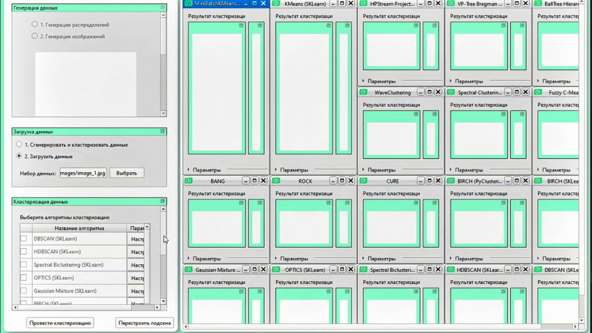

# DMM Clustering System

**Лицензия:** [GNU GPL](https://wiki2.org/ru/GNU_GPL) + [CC BY](https://wiki2.org/ru/Лицензии_и_инструменты_Creative_Commons#CC_Attribution_(сокращённо_CC_BY))


## Содержание

- [Краткое описание проекта](#краткое-описание-проекта)
- [Общая архитектура и структура директорий](#общая-архитектура-и-структура-директорий)
- [Как устроены методы кластеризации](#как-устроены-методы-кластеризации)
- [Запуск проекта](#запуск-проекта)
  - [Зависимости](#зависимости)
  - [Подготовка данных](#подготовка-данных)
  - [Команды запуска](#команды-запуска)
  - [Примеры использования](#примеры-использования)
- [Демонстрация работы](#демонстрация-работы)
- [Авторы проекта](#авторы-проекта)
- [FAQ](#faq)

---

## Краткое описание проекта

**DMM Clustering System** — это программная система для кластеризации данных, разработанная на языке Python с использованием графического интерфейса на базе PySide6. Система предоставляет единый интерфейс для работы с множеством алгоритмов кластеризации, поддерживает как синтетические данные (сгенерированные через make-функции), так и изображения, и позволяет визуализировать результаты кластеризации в 2D и 3D пространстве.

### Основные возможности

- **18+ алгоритмов кластеризации** из различных библиотек (scikit-learn, pyclustering) и собственные реализации
- **Графический интерфейс** для удобной настройки параметров и визуализации результатов
- **Гибкая архитектура** на основе паттерна Strategy, позволяющая легко добавлять новые методы
- **Поддержка различных типов данных**: точки в многомерном пространстве, изображения, синтетические датасеты
- **Визуализация результатов** в 2D и 3D с возможностью экспорта
- **Методы анализа качества** кластеризации для оценки результатов
- **Генераторы синтетических данных** для тестирования алгоритмов

---

## Общая архитектура и структура директорий

### Архитектура системы

Система построена на основе **паттерна Strategy**, который обеспечивает гибкость и расширяемость:

```
┌─────────────────────────────────────────────────────────┐
│              Frameworks_interface                       │
│         (Графический интерфейс - PySide6)               │
└──────────────────┬──────────────────────────────────────┘
                   │
┌──────────────────▼──────────────────────────────────────┐
│              Frameworks_ccore                           │
│    (Ядро: загрузка настроек, управление стратегиями)   │
└──────────────────┬──────────────────────────────────────┘
                   │
┌──────────────────▼──────────────────────────────────────┐
│           ClusteringMethods                              │
│  (Алгоритмы кластеризации через Strategy Pattern)        │
└──────────────────┬──────────────────────────────────────┘
                   │
┌──────────────────▼──────────────────────────────────────┐
│         DatasetsGenerators / DatasetsImages              │
│              (Источники данных)                          │
└──────────────────────────────────────────────────────────┘
```

### Структура директорий

```
DMM_ClusteringSystem/
├── ClusteringMethods/          # Методы кластеризации
│   ├── ClasteringAlgorithms.py # Базовые классы (Strategy, Context, StrategiesManager)
│   ├── WaveClusteringAlgorithm.py
│   ├── BallTreeClustering.py
│   ├── HPStreamClasteringAlgorithm.py
│   ├── KMeansClustering.py
│   ├── MiniBatchKMeansClustering.py
│   ├── VPTreeClustering.py
│   └── README.md               # Документация по методам
│
├── AnalysisMethods/            # Методы анализа качества кластеризации
│   ├── AnalysisAlgorithms.py
│   └── README.md
│
├── DatasetsGenerators/         # Генераторы синтетических данных
│   ├── make_blobs.py
│   ├── make_circles.py
│   ├── make_moons.py
│   ├── make_spheres.py
│   ├── make_dna.py
│   └── README.md
│
├── DatasetsImages/             # Наборы данных (изображения и CSV)
│   ├── images/
│   └── csv/
│
├── Frameworks_ccore/           # Ядро системы
│   ├── Loader.py               # Загрузка настроек
│   ├── SettingsApp.py          # Управление настройками
│   └── README.md
│
├── Frameworks_interface/       # Графический интерфейс
│   ├── mainwindow.py           # Главное окно
│   ├── form.ui                 # Описание UI
│   ├── strategy_options_dialog.py # Диалог настроек
│   ├── widgets/                # Кастомные виджеты
│   └── README.md
│
├── TestMethods/                # Тестирование алгоритмов
│   ├── test_*.py               # Тесты для каждого алгоритма
│   ├── test_template.py        # Шаблон для новых тестов
│   ├── Images/                 # Результаты тестирования
│   └── README.md
│
├── Examples/                   # Примеры результатов кластеризации
│   ├── example 1 - points clustering/
│   └── example 2 - image clustering/
│
├── Documentation/              # Вся документация проекта
│   ├── Programming documentation/  # Программная документация
│   │   ├── Как добавить новый метод кластеризации.md
│   │   ├── developer's guide.docx
│   │   └── Research/
│   ├── Theoretical documentation/  # Теоретическая документация
│   │   └── *.pdf                   # PDF с описанием алгоритмов
│   └── Developer notes/        # Заметки разработчиков о фазах проекта
│
├── main.py                     # Точка входа приложения
├── ClustSystem.pyproject       # Конфигурация PySide6 проекта
├── requirements.txt            # Зависимости Python
├── BUILD.md                    # Инструкции по сборке
└── README.md                   # Этот файл
```

### Описание ключевых компонентов

| Компонент | Назначение |
|-----------|------------|
| `ClusteringMethods/` | Содержит все алгоритмы кластеризации, реализованные через паттерн Strategy |
| `Frameworks_ccore/` | Ядро системы: управление стратегиями, загрузка настроек |
| `Frameworks_interface/` | Графический интерфейс на PySide6 для взаимодействия с пользователем |
| `AnalysisMethods/` | Методы оценки качества кластеризации (метрики, визуализация) |
| `DatasetsGenerators/` | Генераторы синтетических данных для тестирования |
| `TestMethods/` | Скрипты для тестирования и валидации алгоритмов |

---

## Как устроены методы кластеризации

### Паттерн Strategy

Все методы кластеризации реализованы через **паттерн Strategy**, что обеспечивает:

- **Единый интерфейс** для всех алгоритмов
- **Легкое добавление** новых методов без изменения основного кода
- **Гибкую настройку параметров** через графический интерфейс
- **Автоматическую регистрацию** новых алгоритмов в системе

### Архитектура метода кластеризации

Каждый метод кластеризации должен:

1. **Наследоваться от класса `Strategy`** из `ClusteringMethods.ClasteringAlgorithms`
2. **Реализовать метод `_setupParams(cls)`** — описание параметров алгоритма
3. **Реализовать методы кластеризации**:
   - `clastering_points()` — для кластеризации точек
   - `clastering_image()` — для кластеризации изображений
4. **Зарегистрироваться через декоратор** `@StrategiesManager.registerStrategy()`

### Пример структуры метода

```python
@StrategiesManager.registerStrategy(
    "algorithm_id",           # Уникальный ID
    "Algorithm Name",          # Отображаемое имя
    "Описание алгоритма"      # Описание (опционально)
)
class ConcreteStrategyAlgorithm(Strategy):
    
    @classmethod
    def _setupParams(cls):
        """Описание параметров алгоритма"""
        cls._addParam(
            "param_name",           # Имя параметра
            "Отображаемое имя",     # Имя в UI
            StrategyParamType.UNumber,  # Тип параметра
            "Описание параметра",   # Подсказка
            default_value           # Значение по умолчанию
        )
    
    def clastering_points(self, points: np.ndarray, 
                          params: StrategyRunConfig) -> np.ndarray:
        """Кластеризация точек"""
        # Реализация алгоритма
        return labels
    
    def clastering_image(self, pixels: np.ndarray,
                        params: StrategyRunConfig) -> np.ndarray:
        """Кластеризация изображения"""
        # Реализация алгоритма
        return labels
```

### Доступные типы параметров

- `StrategyParamType.UNumber` — целое число
- `StrategyParamType.UFloating` — вещественное число
- `StrategyParamType.Switch` — выбор из списка значений
- `StrategyParamType.Bool` — булево значение

### Подробная документация

Подробное описание процесса добавления нового метода кластеризации доступно в файле:
- [`Documentation/Programming documentation/Как добавить новый метод кластеризации.md`](Documentation/Programming%20documentation/Как%20добавить%20новый%20метод%20кластеризации.md)

Полный список реализованных методов и их параметров:
- [`ClusteringMethods/README.md`](ClusteringMethods/README.md)

---

## Запуск проекта

### Зависимости

Система требует следующих зависимостей (указаны в `requirements.txt`):

```txt
numpy
scipy
matplotlib
scikit-learn>=1.3.2
pandas
Pillow
pyclustering
PySide6
qstylizer
opencv-python
scikit-fuzzy
PyWavelets
```

**Минимальные требования:**
- Python 3.11 или выше
- Операционная система: Windows, Linux, macOS
- Рекомендуется: 4+ GB RAM для работы с большими наборами данных

### Установка зависимостей

#### Вариант 1: Установка через pip (рекомендуется)

```bash
# Создайте виртуальное окружение
python -m venv venv

# Активируйте виртуальное окружение
# Windows:
venv\Scripts\activate
# Linux/macOS:
source venv/bin/activate

# Установите зависимости
pip install -r requirements.txt
```

#### Вариант 2: Установка через conda

```bash
# Создайте окружение conda
conda create -n dmm_clustering python=3.11
conda activate dmm_clustering

# Установите зависимости
pip install -r requirements.txt
```

### Подготовка данных

Система поддерживает два типа данных:

#### 1. Точки в многомерном пространстве

Данные должны быть представлены в формате:
- **CSV файл** с координатами точек (каждая строка — точка, столбцы — измерения)
- **NumPy массив** формата `(n_samples, n_features)`

Пример CSV:
```csv
x1,x2,x3
1.2,3.4,5.6
2.1,4.3,6.5
...
```

#### 2. Изображения

Поддерживаемые форматы:
- **JPEG** (`.jpg`, `.jpeg`)
- **PNG** (`.png`)
- **BMP** (`.bmp`)

Изображения автоматически конвертируются в массив пикселей для кластеризации.

#### Генерация синтетических данных

Для тестирования можно использовать генераторы из `DatasetsGenerators/`:

```python
from DatasetsGenerators.make_blobs import make_blobs
from DatasetsGenerators.make_circles import make_circles
from DatasetsGenerators.make_moons import make_moons

# Генерация данных
X, y = make_blobs(n_samples=300, n_features=2, centers=3)
```

### Команды запуска

#### Сборка проекта

Перед первым запуском необходимо собрать проект (компиляция UI и ресурсов):

```bash
pyside6-project build ClustSystem.pyproject
```

Подробнее о сборке: [`BUILD.md`](BUILD.md)

#### Запуск через PySide6 Project

```bash
pyside6-project run ClustSystem.pyproject
```

#### Запуск через Python

После сборки проекта можно запускать напрямую:

```bash
python main.py
```

#### Запуск тестов алгоритмов

Для тестирования конкретного алгоритма:

```bash
# Тест WaveClustering
python TestMethods/test_wave.py

# Тест DBSCAN
python TestMethods/test_dbscan.py

# Тест других алгоритмов
python TestMethods/test_*.py
```

Подробнее о тестировании: [`TestMethods/README.md`](TestMethods/README.md)

### Примеры использования

#### Пример 1: Запуск GUI приложения

```bash
# 1. Установите зависимости
pip install -r requirements.txt

# 2. Соберите проект
pyside6-project build ClustSystem.pyproject

# 3. Запустите приложение
pyside6-project run ClustSystem.pyproject
```

В графическом интерфейсе:
1. Выберите метод кластеризации из списка
2. Нажмите "Настройки" для настройки параметров
3. Загрузите данные (точки или изображение)
4. Нажмите "Кластеризация"
5. Просмотрите результаты в 2D/3D визуализации

#### Пример 2: Программное использование через API

```python
import numpy as np
from ClusteringMethods.ClasteringAlgorithms import (
    ConcreteStrategyWaveClustering,
    StrategiesManager,
    Context
)

# Генерация тестовых данных
from sklearn.datasets import make_blobs
X, y_true = make_blobs(n_samples=300, n_features=2, centers=3, random_state=42)

# Получение конфигурации стратегии
config = StrategiesManager.getStrategyRunConfigById("waveclustering")
config["n_grid"] = 32
config["wavelet"] = "haar"
config["n_levels"] = 2
config["density_threshold"] = 0.1

# Создание стратегии и выполнение кластеризации
strategy = ConcreteStrategyWaveClustering()
labels = strategy.clastering_points(X, config)

print(f"Найдено кластеров: {len(np.unique(labels))}")
```

#### Пример 3: Тестирование алгоритма

```python
# test_my_algorithm.py
import sys
from pathlib import Path
import numpy as np
from sklearn.datasets import make_blobs

PROJECT_ROOT = Path(__file__).parent.parent
sys.path.insert(0, str(PROJECT_ROOT))

from ClusteringMethods.ClasteringAlgorithms import (
    ConcreteStrategyWaveClustering,
    StrategiesManager
)

# Генерация данных
X, y_true = make_blobs(n_samples=300, n_features=2, centers=3, random_state=42)

# Настройка и запуск
config = StrategiesManager.getStrategyRunConfigById("waveclustering")
strategy = ConcreteStrategyWaveClustering()
labels = strategy.clastering_points(X, config)

# Визуализация
import matplotlib.pyplot as plt
plt.scatter(X[:, 0], X[:, 1], c=labels, cmap='viridis')
plt.title('Результаты кластеризации')
plt.show()
```

#### Пример 4: Использование генераторов данных

```python
from DatasetsGenerators.make_blobs import make_blobs
from DatasetsGenerators.make_circles import make_circles
from DatasetsGenerators.make_moons import make_moons

# Генерация различных типов данных
blobs_data, blobs_labels = make_blobs(n_samples=300, centers=3)
circles_data, circles_labels = make_circles(n_samples=300, noise=0.05)
moons_data, moons_labels = make_moons(n_samples=300, noise=0.1)
```

---

## Демонстрация работы

### Демонстрация работы системы кластеризации



*GIF-анимация: процесс кластеризации данных через графический интерфейс*

---

## Авторы проекта

### Руководство

**Парфенов Дмитрий Викторович** — к.т.н., доцент  
📧 [promasterden@yandex.ru](mailto:promasterden@yandex.ru)  
🏛️ РТУ МИРЭА  
*Научный руководитель проекта*

---

### Фаза 1: Создание проекта
#### КММО-01-23

| Автор | Роль/Вклад | Контакты |
|-------|------------|----------|
| **Грибань Михаил Сергеевич** | Разработка, архитектура | 📧 [gribanms007@gmail.com](mailto:gribanms007@gmail.com) |
| **Залетин Никита Андреевич** | Разработка, тестирование | 📧 [nicitazaletin@yandex.ru](mailto:nicitazaletin@yandex.ru) |
| **Плахотина Юлия** | Разработка, документация | 📧 [ummka7@gmail.com](mailto:ummka7@gmail.com) |
| **Мешкова Ольга Вячеславовна** | Разработка ядра, методы кластеризации | 📧 [oxn.lar5@yandex.ru](mailto:oxn.lar5@yandex.ru) |
| **Минеев Сергей Алексеевич** | Архитектура, ядро системы | 📧 [mineeff20@yandex.ru](mailto:mineeff20@yandex.ru) |
| **Коминцев Никита** | Разработка, интеграция | 📧 [nikita.comin@gmail.com](mailto:nikita.comin@gmail.com) |
| **Николаев Михаил Алексеевич** | Разработка, тестирование | 📧 [Misha.via@yandex.ru](mailto:Misha.via@yandex.ru) |
| **Федоров Алексей Викторович** | Разработка, визуализация | 📧 [alexis.sasis7@gmail.com](mailto:alexis.sasis7@gmail.com) |
| **Салия Лука Мерабович** | Разработка, документация | 📧 [saliya.luka@bk.ru](mailto:saliya.luka@bk.ru) |

---

### Фаза 2: Расширение функциональности
#### КММО-11-24

| Автор | Роль/Вклад | Контакты |
|-------|------------|----------|
| **Асанов Ярослав Владимирович** | Архитектура Strategy Pattern, методы кластеризации | 📧 [yaroslav.asanov@yandex.ru](mailto:yaroslav.asanov@yandex.ru) |
| **Козлов Алексей Игоревич** | Методы кластеризации, документация | 📧 [alex_kozlov15@mail.ru](mailto:alex_kozlov15@mail.ru) |
| **Воронцов Павел Аркадьевич** | Разработка, тестирование | 📧 [exidna2002@yandex.ru](mailto:exidna2002@yandex.ru) |

---

### Фаза 4: Дальнейшее развитие
#### КММО-11-25 и КММО-12-25

| Автор                            | Роль/Вклад                                | Контакты |
|----------------------------------|-------------------------------------------|----------|
| **Левинский Григорий** | WaveClustering, MiniBatchKMeans           | 📧 [glevinskiy@gmail.com](mailto:glevinskiy@gmail.com) |
| **Кирьянов Даниил**              | BallTree Clustering, VP-Tree Bregman      | 📧 [danyavolskiy@gmail.com](mailto:danyavolskiy@gmail.com) |
| **Ахмерова Анастасия**           | BallTree Clustering, VP-Tree Bregman      | 📧 [anastasia.akhmerova.03@mail.ru](mailto:anastasia.akhmerova.03@mail.ru) |
| **Балыков Павел**                | HPStream Clustering                       | 📧 [p.balykov@gmail.com](mailto:p.balykov@gmail.com) |
| **Мысин Юрий**                   | KMeans с PCA                              | 📧 [yuriymysin@yandex.ru](mailto:yuriymysin@yandex.ru) |
| **Сидоров Данила**               | Разработка тестов, оптимизация алгоритмов | 📧 [sidorov.d.a1@edu.mirea.ru](mailto:sidorov.d.a1@edu.mirea.ru) |

---

### Статус проекта

**Исследовательский проект** по курсу **"Дискретные математические модели"**  
🏛️ **РТУ МИРЭА** (Российский технологический университет)

---

## FAQ

### Общие вопросы

#### Как добавить новый метод кластеризации?

**Ответ:** Процесс добавления нового метода описан в подробной документации:

1. Создайте класс, наследующийся от `Strategy` в `ClusteringMethods/`
2. Реализуйте методы `_setupParams()`, `clastering_points()` и `clastering_image()`
3. Зарегистрируйте метод через декоратор `@StrategiesManager.registerStrategy()`
4. Добавьте зависимости в `requirements.txt`, если используются новые библиотеки

Подробная инструкция: [`Documentation/Programming documentation/Как добавить новый метод кластеризации.md`](Documentation/Programming%20documentation/Как%20добавить%20новый%20метод%20кластеризации.md)

#### Какие форматы данных поддерживаются?

**Ответ:** Система поддерживает:

- **Точки данных**: CSV файлы (строки — точки, столбцы — измерения) или NumPy массивы формата `(n_samples, n_features)`
- **Изображения**: JPEG (`.jpg`, `.jpeg`), PNG (`.png`), BMP (`.bmp`)
- **Синтетические данные**: через генераторы в `DatasetsGenerators/` (blobs, circles, moons, spheres, DNA helix)

Для изображений система автоматически конвертирует их в массив пикселей для кластеризации.

#### Какой метод кластеризации выбрать для моих данных?

**Ответ:** Выбор зависит от характеристик данных:

- **KMeans / MiniBatchKMeans**: для данных с известным количеством кластеров, сферической формы, больших объемов
- **DBSCAN / HDBSCAN**: для данных с неизвестным количеством кластеров, произвольной формы, с шумом
- **WaveClustering**: для данных с кластерами различного масштаба, пространственной структуры
- **HPStream**: для высокомерных потоковых данных
- **Spectral Clustering**: для невыпуклых кластеров, графовых данных
- **GMM**: для вероятностной кластеризации, перекрывающихся кластеров

Подробное описание каждого метода и рекомендации: [`ClusteringMethods/README.md`](ClusteringMethods/README.md)

### Технические вопросы

#### Почему проект не запускается после установки зависимостей?

**Ответ:** Возможные причины:

1. **Не выполнена сборка проекта**: после установки зависимостей необходимо выполнить `pyside6-project build ClustSystem.pyproject`
2. **Неправильная версия Python**: требуется Python 3.11 или выше
3. **Отсутствуют зависимости**: убедитесь, что все пакеты из `requirements.txt` установлены
4. **Проблемы с PySide6**: проверьте установку через `pip install --upgrade PySide6`

Подробнее о сборке: [`BUILD.md`](BUILD.md)

#### Как протестировать алгоритм перед добавлением в GUI?

**Ответ:** Используйте директорию `TestMethods/`:

1. Скопируйте шаблон: `cp TestMethods/test_template.py TestMethods/test_my_algorithm.py`
2. Настройте импорты и параметры в файле теста
3. Запустите: `python TestMethods/test_my_algorithm.py`
4. Результаты сохранятся в `TestMethods/Images/YourAlgorithm/`

Подробная инструкция: [`TestMethods/README.md`](TestMethods/README.md)

#### Как работает Strategy Pattern в системе?

**Ответ:** Паттерн Strategy обеспечивает:

- **Единый интерфейс**: все алгоритмы реализуют методы `clastering_points()` и `clastering_image()`
- **Автоматическую регистрацию**: через декоратор `@StrategiesManager.registerStrategy()` алгоритм автоматически появляется в GUI
- **Гибкую настройку**: параметры каждого алгоритма настраиваются через `_setupParams()` и отображаются в диалоге настроек
- **Изоляцию кода**: добавление нового алгоритма не требует изменения основного кода системы

Архитектура описана в разделе [Как устроены методы кластеризации](#как-устроены-методы-кластеризации).

### Вопросы производительности

#### Система работает медленно на больших данных. Что делать?

**Ответ:** Рекомендации по оптимизации:

1. **Используйте MiniBatchKMeans** вместо KMeans для больших наборов данных
2. **Применяйте PCA** для снижения размерности перед кластеризацией (опция доступна в KMeans и MiniBatchKMeans)
3. **Используйте выборку данных**: для изображений система автоматически применяет выборку при большом количестве пикселей
4. **Выбирайте подходящий алгоритм**: DBSCAN может быть медленным на больших данных, рассмотрите HDBSCAN или MiniBatchKMeans
5. **Ограничьте размер данных**: для тестирования используйте подвыборки

Для потоковых данных используйте **HPStream**, который оптимизирован для больших объемов.

#### Какие алгоритмы самые быстрые?

**Ответ:** По скорости выполнения (от быстрых к медленным):

1. **KMeans / MiniBatchKMeans** — самые быстрые, линейная сложность
2. **BIRCH** — оптимизирован для больших данных
3. **DBSCAN** — средняя скорость, зависит от параметров
4. **Spectral Clustering** — медленный из-за вычисления собственных значений
5. **CURE / ROCK** — медленные, требуют вычисления матриц расстояний

Для очень больших данных рекомендуется **MiniBatchKMeans** или **BIRCH**.

### Вопросы расширения

#### Можно ли использовать систему программно без GUI?

**Ответ:** Да, все методы доступны через программный интерфейс:

```python
from ClusteringMethods.ClasteringAlgorithms import (
    ConcreteStrategyWaveClustering,
    StrategiesManager
)

config = StrategiesManager.getStrategyRunConfigById("waveclustering")
strategy = ConcreteStrategyWaveClustering()
labels = strategy.clastering_points(data, config)
```

Подробные примеры: раздел [Примеры использования](#примеры-использования).

#### Как добавить новый генератор данных?

**Ответ:** Создайте файл в `DatasetsGenerators/` с функцией генерации:

```python
def make_my_dataset(n_samples=100, **kwargs):
    # Ваша реализация
    return X, y
```

Функция должна возвращать кортеж `(X, y)`, где `X` — массив данных, `y` — метки (опционально).

---

## Дополнительные ресурсы

- **Документация по методам**: [`ClusteringMethods/README.md`](ClusteringMethods/README.md)
- **Руководство по тестированию**: [`TestMethods/README.md`](TestMethods/README.md)
- **Инструкции по сборке**: [`BUILD.md`](BUILD.md)
- **Вся документация проекта**: [`Documentation/`](Documentation/)
  - **Программная документация**: [`Documentation/Programming documentation/`](Documentation/Programming%20documentation/)
  - **Теоретическая документация**: [`Documentation/Theoretical documentation/`](Documentation/Theoretical%20documentation/)
  - **Заметки разработчиков**: [`Documentation/Developer notes/`](Documentation/Developer%20notes/)

---

**Последнее обновление:** 2025-12-17
**Версия проекта:** 1.4
